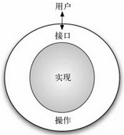

# 为何学习数据结构及抽象数据类型

为了控制问题及其求解过程的复杂度，计算机科学家利用抽象来帮助自己专注于全局，从而避免迷失在众多细节中。

通过对问题进行建模，可以更高效地解决问题。模型可以帮助计算机科学家更一致地描述算法要用到的数据。

如前所述，过程抽象将功能的实现细节隐藏起来，从而使用户能从更高的视角来看待功能。数据抽象的基本思想与此类似。

抽象数据类型（有时简称为 ADT）从逻辑上描述了如何看待数据及其对应运算而无须考虑具体实现。这意味着我们仅需要关心数据代表了什么，而可以忽略它们的构建方式。

通过这样的抽象，我们对数据进行了一层封装，其基本思想是封装具体的实现细节，使它们对用户不可见，这被称为信息隐藏。

下图“抽象数据类型”展示了抽象数据类型及其原理。

用户通过利用抽象数据类型提供的操作来与接口交互。抽象数据类型是与用户交互的外壳。真正的实现则隐藏在内部。用户并不需要关心各种实现细节。

抽象数据类型的实现常被称为数据结构，这需要我们通过编程语言的语法结构和原生数据类型从物理视角看待数据。

正如之前讨论的，分成这两种不同的视角有助于为问题定义复杂的数据模型，而无须考虑模型的实现细节。这便提供了一个独立于实现的数据视角。

由于实现抽象数据类型通常会有很多种方法，因此独立于实现的数据视角使程序员能够改变实现细节而不影响用户与数据的实际交互。用户能够始终专注于解决问题。