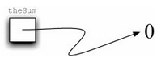
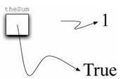

# 内建原子数据类型

我们首先复习原子数据类型。Python 有两大內建数据类实现了整数类型和浮点数类型，相应的 Python 类就是 `int` 和 `float`。

标准的数学运算符，即 `+`、`-`、`*`、`/` 以及 `**`（幂），可以和能够改变运算优先级的括号一起使用。

其他非常有用的运算符包括取余（取模）运算符 `%`，以及整除运算符 `//`。

> **注意**
>
> 当两个整数相除时，其结果是一个浮点数，而整除运算符截去小数部分，只返回商的整数部分。

```
>>> 2+3*4
14
>>> (2+3)*4
20
>>> 2**10 
1024
>>> 6/3
2.0
>>> 7/3
2.3333333333333335
>>> 7//3
2
>>> 7%3
1
>>> 3/6
0.5
>>> 3//6
0
>>> 3%6
3
>>> 2**100
1267650600228229401496703205376
```

Python 通过 `bool` 类实现对表达真值非常有用的布尔数据类型。布尔对象可能的状态值是 `True` 或者 `False`，布尔运算符有 `and`、`or` 以及 `not`。

```
>>> True 
True
>>> False 
False
>>> False or True
True
>>> not (False or True) 
False
>>> True and True 
True
```

布尔对象也被用作相等（`==`）、大于（`>`）等比较运算符的计算结果。

此外，结合使用关系运算符与逻辑运算符可以表达复杂的逻辑问题。下表展示了关系运算符和逻辑运算符：

| 运算名     | 运算符 | 解释                              |
|------------|--------|-----------------------------------|
| 小于       | `<`    | 小于运算符                        |
| 大于       | `>`    | 大于运算符                        |
| 小于或等于 | `<=`   | 小于或等于运算符                 |
| 大于或等于 | `>=`   | 大于或等于运算符                 |
| 等于       | `==`   | 相等运算符                        |
| 不等于     | `!=`   | 不等于运算符                      |
| 逻辑与     | `and`  | 两个运算数都为 `True` 时结果为 `True` |
| 逻辑或     | `or`   | 某一个运算数为 `True` 时结果为 `True` |
| 逻辑非     | `not`  | 对真值取反，`False` 变为 `True`，`True` 变为 `False` |

```
>>> 5 == 10
False
>>> 10 > 5
True
>>> (5 >= 1) and (5 <= 10)
True
```

标识符在编程语言中被用作名字。
- Python 中的标识符以字母或者下划线（_）开头，区分大小写，可以是任意长度。
- 当一个名字第一次出现在赋值语句的左边部分时，会创建对应的 Python 变量。
- 赋值语句将名字与值关联起来。
- 变量存的是指向数据的引用，而不是数据本身。

> **注意**
>
> 采用能表达含义的名字是良好的编程习惯，这使程序代码更易阅读和理解。

来看看下面的代码：

```
>>> theSum = 0
>>> theSum 
0
>>> theSum = theSum + 1
>>> theSum 
1
>>> theSum = True
>>> theSum 
True
```

赋值语句 `theSum = 0` 会创建变量 `theSum`，并且令其保存指向数据对象 `0` 的引用（如下图“变量指向数据对象的引用”所示）。

<p align="center">
    
</p>

Python 会先计算赋值运算符右边的表达式，然后将指向该结果数据对象的引用赋给左边的变量名。

在本例中，由于 `theSum` 当前指向的数据是整数类型，因此该变量类型为整型。

如果数据的类型发生改变（如下图“赋值语句改变变量的引用”所示），正如上面的代码给 `theSum` 赋值 `True`，那么变量的类型也会变成布尔类型。

<p align="center">
    
</p>


赋值语句改变了变量的引用，这体现了 Python 的动态特性。

同样的变量可以指向许多不同类型的数据。