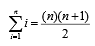

# 何谓算法分析

刚接触计算机科学的同学常常拿自己的程序和别人的做比较。你可能已经注意到了，计算机程序看起来很相似，尤其是简单的程序。

这就产生了一个有趣的问题：当两个看上去不同的程序解决同一个问题时，会有优劣之分么？

要回答这个问题，需要记住，程序和它所代表的算法是不同的。

第 1 章说过，算法是为逐步解决问题而设计的一系列通用指令。

给定某个输入，算法能得到对应的结果——算法就是解决问题的方法。

程序则是用某种编程语言对算法编码。

同一个算法可以对应许多程序，这取决于程序员和编程语言。

为了进一步说明算法和程序的区别，来看看 **`代码清单`** `2-1 计算前 n 个整数之和`：

```
In(1):
def sumOfN(n): 
    theSum = 0
    for i in range(1, n+1):
        theSum = theSum + i 

    return theSum
```

该函数解决了一个常见的问题，即计算前 n 个整数之和。

算法的思路是使用一个初始值为 `0` 的累加器变量，然后遍历 `n` 个整数，并将值加到累加器上。

下面看看 **`代码清单`** `2-2 计算前 n 个整数之和的另一种写法 `：

```
In(2):
def foo(tom): 
    fred = 0
    for bill in range(1, tom+1): 
        barney = bill
        fred = fred + barney 

    return fred 
```

乍看会觉得有些奇怪，但是仔细观察后，你会发现这个函数所做的工作在本质上和前一个相同。

之所以不能一眼看出来，是因为代码写得太差。没有用好的变量名提高可读性，而且在累加时还使用了一条多余的赋值语句。 

前面提出过一个问题：程序是否有优劣之分？

答案取决于你的标准。

如果你关心的是可读性，那么 `sumOfN` 当然比 `foo` 更好。实际上，你可能已经在编程入门课上看过很多例子，毕竟入门课的一个目标就是帮你写出易读的程序。

不过，除了可读性，本书还对描述算法感兴趣。（我们当然希望你继续向着写出易读代码的目标努力。）

算法分析关心的是基于所使用的计算资源比较算法。

我们说甲算法比乙算法好，依据是甲算法有更高的资源利用率或使用更少的资源。从这个角度来看，上面两个函数其实差不多，它们本质上都利用同一个算法解决累加问题。

计算资源究竟指什么？

思考这个问题很重要。

- 有两种思考方式。一是考虑算法在解决问题时要占用的空间或内存。解决方案所需的空间总量一般由问题实例本身决定，但算法往往也会有特定的空间需求，后文会详细介绍。
- 另一种思考方式是根据算法执行所需的时间进行分析和比较。这个指标有时称作算法的执行时间或运行时间。
    - 要衡量 `sumOfN` 函数的执行时间，一个方法就是做基准分析。也就是说，我们会记录程序计算出结果所消耗的实际时间。在 Python 中，我们记录下函数就所处系统而言的开始时间和结束时间。`time` 模块中有一个 `time` 函数，它会以秒为单位返回自指定时间点起到当前的系统时钟时间。在首尾各调用一次这个函数，计算差值，就可以得到以秒为单位的执行时间（多数情况下非常短）。

在 **`代码清单`** `2-3 计算执行时间 ` 中，`sumOfN` 函数在累加前后调用 `time`。函数返回一个元组，由结果与计算时间（单位为秒）构成。如果调用 5 次，每次计算前 10000 个整数之和，会得到如下结果：

```
In(3):
import time

def sumOfN2(n): 
    start = time.time()

    theSum = 0
    for i in range(1, n+1): 
        theSum = theSum + i 

    end = time.time()

    return theSum, end-start
```

```
In(4):
for i in range(5): 
    print("Sum is %d required %10.7f seconds" % sumOfN2(10000))
Out(4):
Sum is 50005000 required  0.0010061 seconds
Sum is 50005000 required  0.0010066 seconds
Sum is 50005000 required  0.0007987 seconds
Sum is 50005000 required  0.0008330 seconds
Sum is 50005000 required  0.0007877 seconds
```

可以看出，执行时间基本上是一致的，平均约为 0.00088642 秒。如果计算前 100000 个整数之和，又会如何呢？

```
In(5):
for i in range(5): 
    print("Sum is %d required %10.7f seconds" % sumOfN2(100000)) 
Out(5):
Sum is 5000050000 required  0.0087745 seconds
Sum is 5000050000 required  0.0090322 seconds
Sum is 5000050000 required  0.0077043 seconds
Sum is 5000050000 required  0.0079727 seconds
Sum is 5000050000 required  0.0090580 seconds
```

这次的平均执行时间 为 0.00850834，差不多是前一个例子的 10 倍。 

现在来看看 **`代码清单`** `2-4 `，其中给出了解决累加问题的新方法。

函数 `sumOfN3` 使用以下公式计算前 `n` 个整数之和，不必使用循环：

<p align="center">
    
</p>

对 `sumOfN3` 做同样的基准测试，`n` 取 5 个值（10000、100000、1000000、10000000 和 100000000），会得到以下结果：

```
In(6):
import time

def sumOfN3(n):
    start = time.time()
    result = (n * (n + 1)) / 2
    end = time.time()
    elapsed = end - start
    return result, elapsed

n_values = [10000, 100000, 1000000, 10000000, 100000000]

for n in n_values:
    result, elapsed = sumOfN3(n)
    print("For n = %d, Sum is %d, required %10.7f seconds" % (n, result, elapsed))
Out(6):
For n = 10000, Sum is 50005000, required  0.0000000 seconds
For n = 100000, Sum is 5000050000, required  0.0000000 seconds
For n = 1000000, Sum is 500000500000, required  0.0000000 seconds
For n = 10000000, Sum is 50000005000000, required  0.0000000 seconds
For n = 100000000, Sum is 5000000050000000, required  0.0000000 seconds
```

关于这个结果，有两点要注意。

首先，记录的耗时比之前的例子都要短。

其次，不管 `n` 取什 么值，耗时都很稳定。

看起来 `sumOfN3` 不太受整数数目的影响。

不过，以上基准测试结果的意义到底是什么呢？

直觉上，循环方案看上去工作量更大，因为有些步骤重复。这好像是耗时更久的原因。而且，循环方案的耗时会随着 `n` 一起增长。

然而，这里有个问题。如果在另一台计算机上运行这个函数，或用另一种编程语言来实现，很可能会得到不同的结果。如果计算机再旧些，`sumOfN3` 的执行时间甚至更长。

所以，我们需要更好的方式来描述算法的执行时间。

基准测试计算的是执行算法的实际时间。这不是一个有用的指标，因为它依赖于特定的计算机、程序、时间、编译器与编程语言。

我们希望找到一个独立于程序或计算机的指标。这样的指标在评价算法方面会更有用，可以用来比较不同实现下的算法。

