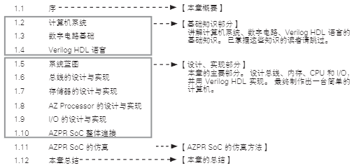

# 序 

本章将实现一台简单的计算机系统的 SoC（System-on-a-Chip，片上系统）。

它以 CPU 为核心，同时实现了负责存储程序和数据的内存、负责和外部进行输入输出的 I/O 以及它们之间的连接总线。

SoC 是将一整套系统集成到单一芯片的集成电路设计方法。 

开发之前，我们先来确定 CPU 的名字。我们为这次开发的 CPU 取名为 AZ Processor，因为本书旨在从头到尾亲自动手设计和实现一台计算机，这几个英文字母就含有从 A 到 Z 全部亲手制作的意思。

然后，AZ Processor、内存、各种 I/O 通过总线连接形成的 SoC，我们称之为 AZPR SoC（AZ Processor 片上系统）。下图为 AZPR SoC 的概要：

    

下图列出了本章的结构：

    

1.2 节 ~ 1.4 节分别简单介绍计算机系统、数字电路基础和 Verilog HDL 语言。这 3 节的内容是制作 AZPR SoC 需要掌握的最基础的知识。已经掌握这些知识和设计经验的读者，可以跳过此部分。

1.5 节 ~ 1.10 节是本章主要的设计和实现部分。1.5 节将对 AZPR SoC 进行说明。

1.6 节 ~ 1.9 节将分别对总线、内存、CPU 和 I/O 的设计和实现进行说明。

1.10 节将各个模块连接，完成 AZPR SoC 的制作。

1.11 节介绍 AZPR SoC 的仿真。

最后的 1.12 节对本章进行总结。