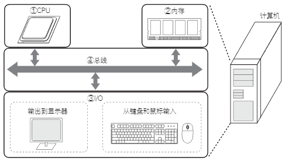

# 什么是计算机

计算机是根据程序进行运算和数据处理的计算机器。

近年来，随着 PC（Personal Computer，个人电脑）在普通家庭中的广泛普及，计算机对我们的生活产生了深远的影响。

如今，不仅是 PC，与我们生活息息相关的手机、家电等也广泛应用了计算机。 

通常，计算机由以下几部分组成：

负责计算和处理数据的 CPU、负责存储程序和数据的存储器，以及和外部进行数据交换的 I/O（Input/Output，输入输出装置）。

各部分通过总线连接就构成了一台计算机。 

计算机的构成要素如下图所示：

    

以 PC 机的组成为例，一般使用 Intel 或 AMD 公司的 CPU，DDR3 SDRAM 之类的内存，另外还有键盘、鼠标、显示器等 I/O。

这些 CPU、内存、I/O、总线并不局限于 PC，多数计算机都是由这四大要素组成。