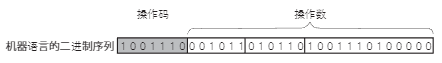

# 什么是 CPU

CPU 是计算机中进行各种运算和数据处理的装置。CPU 是 Central Processing Unit （中央处理器）首字母的缩写。

近年来，商用 CPU 基本都基于集成电路技术制造，然后封装到下图所示的包装后出售：

    

CPU 是一种根据指令进行各种处理的电子电路。

图 1-5 展示的是 CPU 的处理流程。 

    

内存存储着可由 CPU 执行的指令集合所组成的程序。

CPU _①读取（Fetch）_ 内存中的指令，然后对其要处理的操作进行 _②解码（Decode）_，最后进行 _③执行_。

CPU 基本上就是在这三种状态之间进行任务处理。

这种将存储在内存中的程序读出再执行的架构称为存储程序式架构 A 。

- **①读取（Fetch）**
    - 首先，CPU 要把即将执行的指令从内存中读取出来。CPU 中有个 PC（Program Counter，程序计数器）寄存器，其中保存着即将执行的指令的地址。指令的读取是通过将 PC 寄存器的值输出给内存，由内存返回该值对应地址中的指令。
- **②解码**
    - 然后，CPU 对读取的指令所对应的操作进行解码。指令有很多种，有进行各种运算的指令、控制下一条命令的指令、对内存和 I/O 进行读写的指令，还有对 CPU 进行控制的指令。这些指令由 CPU 中被称为指令解码器的模块进行解码。可以用来保存地址和运算结果的寄存器称为通用寄存器（General Purpose Register）
- **③执行** 
    - 最后，CPU 对解码器确定的操作进行处理。CPU 可以从内部存储装置——寄存器或外部的内存读取数据并处理，然后将结果写回寄存器或内存。
    
简化的 CPU 内部构造图如下图所示：

    

读取指令时，CPU 将 PC 寄存器的值输出到内存，然后从内存中将对应的指令取回。

取回的指令保存在指令寄存器中。

指令解码是将储存在指令寄存器的指令解码，确定将要处理的操作。

大多数情况下，在确定即将处理的操作的同时，CPU 会从通用寄存器中读取运算要使用的数据。

指令执行时，从通用寄存器将操作数值取出，通过运算器处理然后将结果写回。

CPU 执行的运算结果可以写回通用寄存器，也可写入内存。CPU 也可以从内存读取数据作为结果返回。

CPU 执行的指令，由代表操作种类的操作码和代表操作对象的操作数两部分组成。

指令的构造如下图所示：

    

指令本身用特定的二进制序列来表示，这种二进制序列称为机器语言。

操作数是由寄存器地址、内存地址或立即数来指定的。

立即数是指嵌入指令中的固定常数。

操作数的数量和位宽根据 CPU 和指令的不同而不同。根据可使用的操作数的数量，指令可以分为 3 操作数形式、2 操作数形式和 1 操作数形式等。

根据执行的指令的特征，CPU 分为 RISC（Reduced Instruction Set Computer，精简指令集计算机）和 CISC（Complex Instruction Set Computer，复杂指令集计算机）两种。 

下表比较了 RISC 和 CISC 的特征，并给出了其代表产品：

| 类型   | 指令功能 | 指令数量 | 硬件高速化 | 执行相同处理时的指令数 | 代表产品                                      |
|--------|----------|----------|------------|------------------------|---------------------------------------------|
| RISC   | 单纯     | 少       | 简单       | 适合                   | IBM Power、Sun MicroSystems SPARC、MIPS、ARM 等 |
| CISC   | 复杂     | 多       | 复杂       | 不适合                 | Intel i386、IBM System/360、DEC PDP 等       |

RISC 类 CPU 的指令功能单纯，种类较少。相对应地，CISC 类 CPU 的指令功能复杂，种类繁多。RISC 指令精简的好处是 CPU 内部构造可以简化，适合高速操作。但是在进行相同操作时，由于每一条指令都功能单纯，所以与 CISC 相比，它需要使用更多的指令数量。虽然 
CISC 的内部构造复杂不适合高速操作，但进行相同处理时指令数比 RISC 要少。

RISC 架构最大的特点是只使用载入和存储指令访问内存，这种架构称为载入存储架构（Load/Store Architecture）。这样做的好处是可以简化指令集和流水线设计。在这种架构下，运算指令只能对寄存器中的数据进行操作。

RISC 和 CISC 两种架构各有所长，孰优孰劣不能一概而论。在追求高速运作的 CPU 的领域中，RISC 被认为更具优势。这些年，虽然 Intel 和 AMD 两家公司的 CPU 指令集依然是 CISC 的，但内部却将复杂指令分解为简单指令，使得内部可以像 RISC 一样工作。

> **CPU 的位宽**
>
> CPU 的位宽表现了 CPU 可以访问的地址空间或数据的大小。比如，32 位 CPU 可以处理 32 位的数据，可以访问的地址空间为 4G 字节（2 的 32 次方）。随着程序、数据的规模和内存容量的增大，32 位 CPU 有些不太够用，最近的 CPU 一般都是 64 位。CPU 的位宽并没有明确的定义。有根据寄存器或地址的宽度划分的，也有根据指令或总线宽度划分的各种标准。现在大家普遍将 CPU 可以处理的整数型数据的宽度定为位宽。实际上，根据 CPU 厂家的想法和主张，解释也不尽相同。除了位宽，CPU 可以访问的地址空间或数据的大小还用字（word）来表示。通常，CPU 的字长和位宽是一致的。
