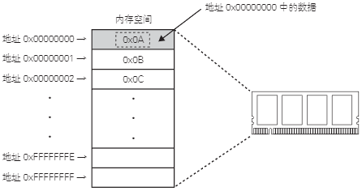
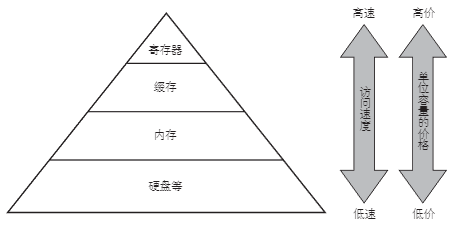

# 什么是内存

内存是用来存放运行时指令（程序）和数据的存储器。

为了和计算机中长期保存数据和程序的存储器区别，内存有时也称为主存（Main memory）。

最近的计算机通常采用 DRAM（Dynamic Random Access Memory，动态随机存储器）技术的内存。DRAM 是通过在电容器中积蓄电荷来保存数据的存储元件。电容器中充电状态是 1，放电状态是 0，以此来表示数值。

由于电容器中的电荷一段时间后会衰减，所以 DRAM 需要定期进行重新写入数据的刷新（Refresh）操作。

根据访问方式和规格的不同，DRAM 分为 SDRAM（Synchronous DRAM，同步 DRAM）和 DDR SDRAM（Double Data Rate SDRAM，双倍数据率 SDRAM）等种类。

内存使用地址的概念来管理存储的数据。地址表示的是数据存储的位置，如同数据的住所一样。每个数据单元都有一个地址。大多情况下数据单元是一个字节（8 位）长度。这种方式称为字节编址。

下图说明了内存和地址的关系：

    

内存等存储器的特点是速度越快成本越高。因此通常使用“高速小容量”、“中速中等容量”到“低速大容量”等多种存储器组合的混合型架构。这种构造称为存储器层级。

下图是存储器层级的示例：

    

在存储层面，速度最快的是 CPU 中的寄存器。CPU 比内存速度快很多，由 CPU 直接访问内存效率较低。为了提高内存访问速度，在 CPU 和内存间增加了被称为缓存的高速小容量存储器。缓存可以暂时性地缓冲存储从内存中读取的数据。CPU 在访问内存时，如果需要的数据已经保存在缓存中，则可直接从缓存中读取，以提高访问效率。根据容量和速度的不同，缓存也分为多个层级，通常为一级缓存、二级缓存等多个级别。