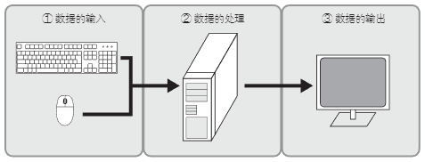

# 什么是 I/O

I/O（Input/Output）是进行数据输入输出的装置。计算机通过 I/O 和外部实现数据交换。

计算机的处理操作按照从外部读取数据、在内部处理数据、再向外部输出结果的顺序进行。

以个人电脑为例，如下图所示，它从鼠标或键盘输入数据，处理器根据程序处理数据，通过显示器等向外部输出结果：

    

**字节序**

将多字节数据存储在内存中时，各字节的存储顺序称为字节序。比如，将 4 字节数据 0x12345678 放入内存时，地址 0 中放 0x12、地址 1 中放 0x34、地址 2 中放 0x56、地址 3 中放 0x78 的方式，称为大端序。相对地，地址 0 中放 0x78、地址 1 中放 0x56、地址 2 中 放 0x34、地址 3 中放 0x12 的方式，称为小端序。

这两种数据存储方式请参见下图：

    

对人类来说，大端序理解起来比较容易，然而对计算机来说，小端比较容易操作，因为不同长度数据的低位位置是相同的。

不同的 CPU 采用的字节序也不尽相同，由此产生的软件通用性和可移植性的问题也屡屡发生。

Intel 公司的 x86 架构采用的是小端序，而 Sun（现属 Oracle）公司的 SPARC 处理器和 MIPS 科技公司的 MIPS 处理器等采用的是大端序。

最近，很多处理器考虑到软件的通用性和可移植性，同时支持两种字节序并可依据程序切换，这种方式称为双端序。

**访问 I/O 的方式**

访问 I/O 的方式大致分为存储器映射 I/O 和端口映射 I/O 两种。

存储器映射 I/O 方式中，I/O 也和内存一样使用地址进行管理，可以和访问内存一样的方式进行访问。

存储器映射 I/O 的概要如下图所示：

    

存储器映射 I/O 方式中，由于使用访问内存的指令进行 I/O 访问，硬件上较为简化。但缺点是，I/O 也会占用地址空间。

端口映射 I/O 方式中，CPU 含有支持访问 I/O 的专用指令。

端口映射 I/O 的概要如下图所示：

    

端口映射 I/O 方式的优点，一是地址空间可以全部分配到内存，二是内存和 I/O 的访问可以在指令级别区分。但是，由于需要专用指令，缺点是硬件设计变得复杂。