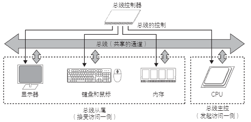

# 什么是总线

总线是 CPU、内存和 I/O 之间交换数据的共同通道。总线将一根信号线在多个模块间共享进行通信。

下图是总线的示例：

    

两个模块通过总线交换数据时，发起访问的一侧称为总线主控，接受访问的一侧称为总线从属。

示例中，CPU 为总线主控，内存、I/O 等为总线从属。 

总线一般由数据总线、地址总线和控制总线构成。

数据总线用来传输交换的数据，地址总线用来指定访问的地址，控制总线负责总线访问的控制。

各个信号的时序、进行交换的规则等称为总线协议。

通过总线交换数据的整个过程称为总线传输。总线传输的示例请参见下图：

    

**申请使用总线**

多数情况下，总线上接有多个总线主控，由于总线是共享的通道，不能同时使用多个总线主控。因此，需要对多个总线主控的使用请求进行调停。访问总线的权力称为总线控制权，对多个访问的调停称为总线仲裁。总线仲裁由总线控制器内的仲裁器实施。总线主控在访问总线之前先向总线控制器申请总线控制权。 

**许可使用总线**

总线控制器对多个总线主控的请求进行调停，依据仲裁规则对总线的使用进行许可授权。

**请求访问**

获取总线控制权的总线主控对总线从属发送访问请求。请求中包含“要访问哪个地址”、“是读取访问还是写入访问”和“写入时的数据”等信息。由于总线是共享的通道，总线主控输出的信号会发送到所有总线从属。因此使用片选信号（Chip select，芯片选择信号）等控制信号来区别对哪个从属进行访问。每个总线从属都设有片选信号，可以使用片选信号选择要访问的总线从属。一般的总线结构会为每个总线从属分配地址空间。总线控制器内的地址解码器根据要访问的地址产生片选信号。

**请求的应答**

接受访问的总线从属会根据请求对总线主控进行应答。针对请求，应答时采用 Ready 等控制信号。在接受读取请求时，应答的同时输出读出的数据。

**释放总线控制权**

总线使用完毕，总线主控通知总线控制器释放总线控制权。

**总线的优缺点**

总线的优点是只要遵循总线协议，任何设备都可以简单地进行连接。并且由于使用的是共享通道，硬件的成本也比较低。但是，数据传输的吞吐量较低。

近几年，一台计算机搭载多个 CPU 的情况比较常见。随着与总线通信的 CPU 数量的增多，总线很容易变得拥堵。因此，业内也在开发各个节点通过网络连接的技术来替代传统的通道共享的总线。