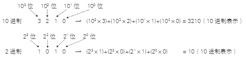

# 数值表达

数字电路中的信息由 0 和 1 两个数字表示，因此数字电路的设计基于二进制数（binary number）。

二进制是指从 0 到 1 的数值在一位数字中表示，遇 2 则向上进位的数值表达方式。二进制的第 n 个数字位，数值上是 2 的 n- 1 次方位。我们平时使用的数值表达方式是十进制（decimal number），十进制中，0 到 9 的数值可在一位中表示。

下图说明了二进制和十进制的位值关系：

    

在十进制中，数字 3210 可以表示为：

$(10^3 \times 3) + (10^2 \times 2) + (10^1 \times 1) + (10^0 \times 0)$

二进制数 1010 则可以表示为：

$(2^3 \times 1) + (2^2 \times 0) + (2^1 \times 1) + (2^0 \times 0)$

其对应的十进制值为 10。

一个数字位所能表达的数值个数称为底数，十进制的底数是 10，而二进制的底数是 2。

在计算机中，除了二进制和十进制外，还常用八进制（octal number）和十六进制（hexadecimal number）。

八进制使用从 0 到 7 表示数值，而在十六进制中，数值从 10 到 15 分别用字母 A 到 F 表示，因此使用 0 到 9 加上 A 到 F 来表示十六个数值。

八进制数值通常以 0 开头，以区分十进制等表达方式。十六进制则通常以 0x 开头。0x 中的 x 代表 hexadecimal 中的 x。十六进制也有在末尾加 H 等其他表达方法。

下表列出了利用以上几种进制表达数值的例子：

| 10 进制数 | 2 进制数 | 8 进制数 | 16 进制数 |
|-----------|----------|----------|-----------|
| 0         | 0000     | 000      | 0x0       |
| 1         | 0001     | 001      | 0x1       |
| 2         | 0010     | 002      | 0x2       |
| 3         | 0011     | 003      | 0x3       |
| 4         | 0100     | 004      | 0x4       |
| 5         | 0101     | 005      | 0x5       |
| 6         | 0110     | 006      | 0x6       |
| 7         | 0111     | 007      | 0x7       |
| 8         | 1000     | 010      | 0x8       |
| 9         | 1001     | 011      | 0x9       |
| 10        | 1010     | 012      | 0xA       |
| 11        | 1011     | 013      | 0xB       |
| 12        | 1100     | 014      | 0xC       |
| 13        | 1101     | 015      | 0xD       |
| 14        | 1110     | 016      | 0xE       |
| 15        | 1111     | 017      | 0xF       |