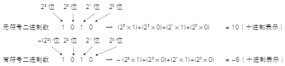

# 有符号二进制数

在用二进制表示有符号数值时，我们经常使用补码表示法。补码表示法中，N 位的二进制数的最高位代表数值 $-(2^{N-1})$。

下图介绍了有符号二进制数的表达方式：

    

**比特和字节**

二进制中的一个数字位称为 binary digit，简称比特（bit）。计算机领域中，我们使用比特作为单位来表示数据量，还会用到一种叫字节（byte）的单位。通常一个字节代表 8 比特，绝大多数 CPU 都是以字节为单位处理数据的。

内存地址大多也是为每字节赋予一个地址，称为字节编址方式。由 8 比特组成一个字节是出于 2 的 8 次方表达的范围（0~255）比较适合表达文字（英文字母、符号、控制符等）的考虑。

**1K 字节有多大**

K、M、G、T 是表示大数据量时常用的单位。1K 的大小有 1000（10 的 3 次方）和 1024（2 的 10 次方）两种计数方法。

通常，衡量计算机内存和网络数据包大小时，1K 相当于 1024 比特。而在硬盘等存储器的标签上记述的尺寸或物理学中的 1K 相当于 1000。

下表是对单位的说明：

| 单位 | 1K 等于 1024 时                     | 1K 等于 1000 时                     |
|------|--------------------------------------|--------------------------------------|
| 1 [K] | 1,024 (2 的 10 次方)               | 1,000 (10 的 3 次方)                |
| 1 [M] | 1,048,576 (2 的 20 次方)           | 1,000,000 (10 的 6 次方)            |
| 1 [G] | 1,073,741,824 (2 的 30 次方)       | 1,000,000,000 (10 的 9 次方)        |
| 1 [T] | 1,099,511,627,776 (2 的 40 次方)   | 1,000,000,000,000 (10 的 12 次方)   |

无符号二进制数变成补码时，将所有比特反转（又称取反码）后加 1。以 4 位二进制数 0001 为例，全比特反转后为 1110，然后加 1 成为 1111。也就是说，在二进制的补码表示法中，将数字 1 表示为 0001，-1 表示为 1111。这就是说最高位的比特起到了符号位的作用。最高位为 0 时是正数，最高位为 1 时是负数。

二进制补码表示法的好处是正数和负数相加时无需考虑符号的处理。以刚才例子中的 1 和 -1 的补码相加为例，0001 加 1111 后进位得到 10000。当数据宽度为 4 位时忽略第五位的 1，结果为 0000，也就是正确答案——数值 0。如上所示，运用二进制补码表示法可以在不关心数据符号的情况下进行运算。