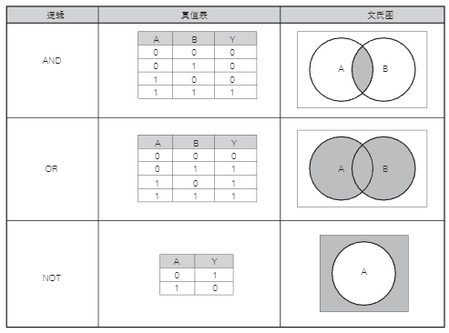

# 逻辑运算

逻辑运算是只用“真”、“假”二值进行的运算。

数字电路中的 H(1) 和 L(0) 可与逻辑运算中的“真”、“假”对应，进行逻辑运算。

逻辑运算使用 AND（逻辑“与”）、OR（逻辑“或”）、NOT（逻辑“非”）三种基本运算组合来实现各种运算。

下图对基本的逻辑运算进行了说明：

    

图中 A 和 B 为输入，Y 为运算结果。

AND 运算在输入 A 和 B 双方都为真时结果 Y 为真，其他情况下 Y 为假。因此 AND 运算的结果是 A 和 B 的交集。

OR 运算在输入 A 和 B 任意一方为真时结果 Y 为真，A 和 B 双方皆为假时结果 Y 为假。因此 OR 运算的结果是 A 和 B 的并集。

NOT 运算是单输入的运算，输入为真时结果为假，输入为假时结果为真。因此 NOT 运算的结果是输入 A 的补集。