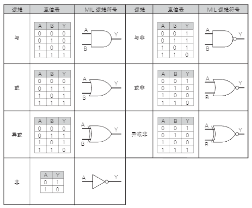

# CMOS 基本逻辑门电路

接下来介绍 CMOS 的基本逻辑门电路。N 型 MOSFET 和 P 型 MOSFET 的电路符号如下图所示：

    

将 MOSFET 按照下图的方式组合即可实现 NOT 门电路。当输入 H 时，N 型 MOSFET 打开，输出为 L ；当输入 L 时，P 型 MOSFET 打开，输出为 H。

    

从最简单的 NOT 门电路到各种逻辑门电路，都可以由 MOSFET 的组合进行实现。

下图中列出的是逻辑门电路中定义的基本逻辑门电路：

    

逻辑门电路的电路符号称为 MIL（美军标准）逻辑符号。

数字电子电路通过基本逻辑电路的组合来实现各种逻辑电路功能。