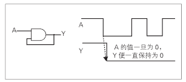

# 存储元件

通过组合基本的逻辑门，可以实现用来保存数据的存储元件。锁存器（Latch）就是其中一种存储元件。锁存器具有像闩锁一样锁住并维持数据的特性。

下图是一种最为单纯的锁存器，其电路由一个 2 输入的 AND 门构成，并将输出与其中一个输入相接形成一条循环回路。一旦这个电路的输入 A 为 0 时，循环回路中的值就一直为 0。这样就可以利用循环回路将逻辑值锁存。

    

还有一种锁存器叫 D 锁存器（Data Latch，D-Latch，数据锁存器）。

D 锁存器的电路构造如图 1-26 所示，它由 4 个 NAND 门电路构成。

D 锁存器中有 D（Data）和 E （Enable）两个输入信号，Q 和 Q 两个输出信号。

D 锁存器在 E 为 0 时保持前一个数据，E 为 1 时将输入 D 的数据输出到 Q。

Q 是输出信号 Q 的反相信号。D 锁存器的真值表如图 1-27 所示。

由于 D 锁存器在 E 为 1 时输入的 D 直接通过 Q 输出，所以也称为通过型锁存器。