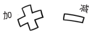
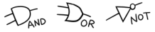

# 计算机的核心是 CPU（中央处理器）

**狩野佑：**

> CPU 是英文 Central Processing Unit 的缩写，意思是“**中央处理器**”
> 
> 也就是说，CPU 的主要工作是……
> 
> **运算**

**桂城步美：**

> 哎——慢着……运算？！
> 
> ……是什么意思？

**狩野佑：**

> “运算”指的是**计算机进行的计算**
> 
> 计算机是只使用 0 和 1 不断进行计算的
> 
> 顺便说一下，CPU 进行的运算分为“**算术运算**”和“**逻辑运算**”两种
> 
> 计算机进行的算术运算中只有加法和减法。
> 

> 逻辑运算仅依靠 0 和 1 两个数字，原理十分简单。
> 

**桂城步美：**

> 嗯嗯，看来 CPU 也只会简单的计算
> 
> CPU 不足为惧!

**狩野佑：**

> 可不能这么早就放松警惕哦

**注解：**

> 近些年来，有一些 CPU 由于自带浮点运算（FPU: Floating Point Unit）功能，因此可以进行乘法和除法运算。本书不涉及浮点运算，只对基本的计算功能进行解说。

**狩野佑：**

> 下面说的才是重点
> 
> 其实，想要**计算机正常运行**
> 
> **只有 CPU 是不够的**！

**桂城步美：**

> 哦？！还需要其他东西吗？

**狩野佑：**

> 当然啦，你想想看，如果圣诞老人说“送你一个圣诞礼物”
> 
> 却只给了你一块 CPU，会不会觉得不明所以？

**桂城步美：**

> 对这样的圣诞老人，是不是把将棋塞进他嘴里，然后给他一记右勾拳才比较合适？

**狩野佑：**

> 这么暴力的想法，快给我打住！