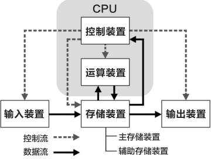
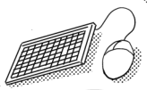
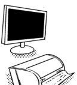
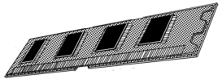
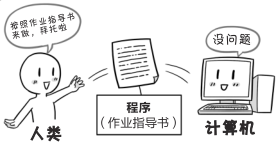
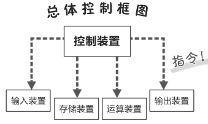
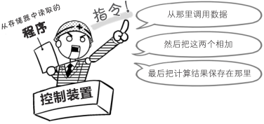

# 计算机的五大装置是什么？

**狩野佑：**

> 下面，我总结一下计算机不可或缺的部分
> 

> 计算机总共有五大装置，CPU 包含**控制装置**和**运算装置**

**注解：**

> 实际上，数据传输是通过输入输出电路实现的，本书将在第 100 页之后进行说明

**桂城步美：**

> 呃……听起来有很多这个那个的，感觉好难……

**狩野佑：**

> 我会给你讲清楚的，你就放心吧……
> 
> 首先，**输入装置**是从外部向计算机发送数据和指令的设备
> 
> 用电脑来举例，输入装置就是键盘和鼠标
> 

> 其次，输出装置则是计算机向外部输出数据的设备
> 

> 电脑显示器和打印机都是很好的例子

**桂城步美：**

> 是哦，我平时也会通过键盘和显示器输入或接收信息

**狩野佑：**

> 还有，**运算装置**便是刚刚提过的负责运算的设备
> 
> 顾名思义，很好理解吧
> 
> 但是，接下来我要划重点了！
> 
> 运算装置要依赖**存储装置**和**控制装置**的辅助才能正常工作！！

**桂城步美：**

> 存储装置……
> 
> 控制装置……
> 
> 还剩这两个，它们究竟是什么呀？

**狩野佑：**

> **存储装置**是保存数据的部分
> 
> 存储装置有两种，分别是**主存储装置**（主存）和辅助存储装置
> 
> **主存**对于理解 CPU 至关重要
> 
> **主存（主存储装置）**也被直接称为“**存储器**”
> 就是这个东西
> 

**桂城步美：**

> 存储器……这个东西为什么这么重要？

**狩野佑：**

> 因为 CPU 的**运算装置**进行运算时，也需要和**存储器**进行“**数据交换**”

**桂城步美：**

> 数据交换？

**狩野佑：**

> 运算的对象**数据**和**程序**都存储在存储器中
> 
> 运算时会调用这些数据和程序，而运算结果又会被保存到存储器里
> 

**注解：**

> 运算有时也会使用 CPU 中的存储装置——寄存器，参见第 70 页。

**桂城步美：**

> 接收、传输……的确有交换一样的感觉!
>
> 说起来，经常被提及的“**程序**”是什么东西？

**狩野佑：**

> 用现在你能理解的语言来解释
> 
> “程序”就好比人类给电脑的“**作业指导书**”
> 
> 需要用到什么样的数据，以及运算要如何进行，还有运算结束后要做什么
> 
> 所有步骤都在作业指导书里
> 

**桂城步美：**

> 原来人类是通过这样的方式给计算机发指令的啊

**狩野佑：**

> 言归正传，最后一个是“**控制装置**”，是给其他四大装置发出指令的设备
> 

> 控制装置给其他装置发指令，控制计算机的内部工作

**桂城步美：**

> 控制装置扮演的角色很重要嘛！是不是就像指挥这个指挥那个的现场主管？

**狩野佑：**

> 差不多算是吧，刚刚说到的程序（作业指导书）就**保存在存储器里**
> 
> 控制装置会从存储器中读取程序，然后解读
> 向各个装置发出指令……
> 

**桂城步美：**

> 也就是说，控制装置是计算机各个装置按照程序（作业指导书）运行
> 
> 所不可或缺的存在啊！

**狩野佑：**

> 说的没错！至此，关于计算机五大装置的介绍就告一段落了……

**桂城步美：**

> 嗯！现在我能理解最初那张图的意思了!
> 

> 各个装置之间互相存在数据交换以及指令收发，对吧！
> 
> 感觉理解**数据流**和**控制流**对于 CPU 学习很重要

**狩野佑：**

> 啊哈哈哈！看到你明白了，我也就放心啦

**桂城步美：**

> ……怎么感觉这家伙还这么有精神……
> 
> 明明讲了这么多话…… 