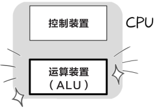
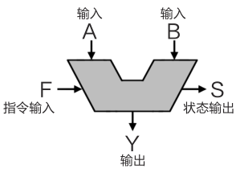
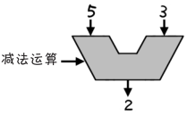
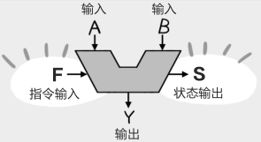
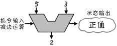

# CPU 的核心是 ALU（算术逻辑单元）

**狩野佑：**

> 你理解能力强，我讲起来就容易多了
> 
> 那么最后，我们来探讨一下 ALU 吧

**桂城步美：**

> ALU ？不是 CPU 吗？怎么又出现新的字母组合了？

**狩野佑：**

> 是的，作为 CPU 的核心，ALU 的功能是进行运算
> 
> 简单点说，它是**运算装置的主要组成部分**！
> 

**桂城步美：**

> 噢……我明白了，的确很重要！

**狩野佑：**

> 嗯，ALU 其实是“Arithmetic Logic Unit”（**算术逻辑单元**）的缩写
> 
> 也就是说，它是执行之前提到的“**算术运算**”和“**逻辑运算**”的装置
> 
> 下面请看 ALU 的示意图
> 

**桂城步美：**

> 呃……这个像盘子一样的 V 字形东西是什么？

**狩野佑：**

> 这个很好理解
> 
> **输入 A** 和**输入 B** 是运算的两个输入数据
> 
> 运算结果便是**输出 Y**

**桂城步美：**

> 哦，我明白了。如 5-3=2，“5”和“3”是输入数据，2”就是输出数据
> 

**狩野佑：**

> 正是如此
> 
> 对了，“**指令输入 F**”就是操作指令
> 

> 指令有“加法运算”“减法运算”……很多种
>
> “状态输出 S”表示的就是运算结果的状态
> 例如，“计算结果是一个正数”之类的

**桂城步美：**

> 就刚刚的 5-3=2 来说，因为运算结果是 2，所以状态输出就是**正值**
> 

> 不过话说回来……“计算结果为正或负”这种信息有什么用？

**狩野佑：**

> 你问的还挺尖锐的。其实，**输出状态是判断结果是否符合条件的依据**

**桂城步美：**

> 条件？判断？