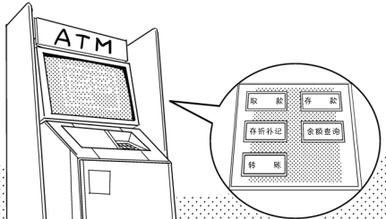

# CPU 进行运算和判断

**狩野佑：**

> 接下来我就详细地讲一下
> 
> 例如，假设计算机的用途为银行 ATM（自动存取款机）
> 

**桂城步美：**

> 我有时也会用

**狩野佑：**

> 当现金被取出的时候，计算机就必须确认取款人的存款余额
> 
> 你可以把“5-3”想象成（**存款** 5 万元）-（**取现** 3 万元）

**桂城步美：**

> ……噢！
> 
> 我明白你说的意思了！原来是这样
> 虽然“5-3”只是简单的减法运算，但是运算结果的**正负**会影响之后的全部过程
> 
> 如果运算结果为**正**，就代表账户里有足够的余额，可以取钱
> 
> 但如果运算结果为**负**，就代表取款人账户的余额不足
> 
> 结果会让人失望
> 
> 所以，会被告知“账户余额不足”了吧

**狩野佑：**

> 是这样的，CPU 就是根据“运算结果是否为正数”
> 
> 来判断取钱人“有没有足够的余额”，进而决定之后的操作
> 

> CPU 就是这样完成“**运算**”和“**判断**”的！
> 

**桂城步美：**

> 哇——只要把**程序（作业指导书）**交给 CPU，它就能完成运算和判断
> 
> 计算机就是通过**反复运算和判断**来实现各种功能的

**狩野佑：**

> 嗯！以超越人类的速度工作，以人类无法做到的方式进行信息处理……计算机可以凭借超越人类的能力做很多事情
> 
> 咯咯咯
> 
> 刚刚将棋赢了你也是一个例子……承让了

**桂城步美：**

> 原来如此，有点明白了
> 
> 不过，不明白的东西还不少，还要继续学习才行

**狩野佑：**

> 嗯
> 
> ……还不错

**桂城步美：**

> 我想要对 CPU 了解得再深一点
> 
> 输了对局让我很不甘心……
> 
> 不对，是超级不爽吧！我觉得我今天都睡不好觉了！
> 
> 但是，既然 CPU 让我尝到了败局，那它就是我的宿敌！
> 
> 所以，我要更加了解我的对手才行！

**狩野佑：**

> 我也觉得这样给人讲计算机还挺有趣的……
> 
> 不，不对，我其实是觉得偶尔逗一逗傻瓜也是一种乐趣……哈哈哈哈

**桂城步美：**

> ……哦哦，是吗 !这样一来，你只能把你懂的东西都给我讲清楚了！

**狩野佑：**

> ？

**桂城步美：**

> ……是这样的吧……感觉你也不像是有朋友的样子……
> 
> 偶尔跟人说说话还挺开心的。虽然宅在家里编程很重要，不过跟人交流也很重要……

**狩野佑：**

> 我这是……反倒被同情了吗？！

**桂城步美：**

> 这样正好，你就来教我学习 CPU 吧
> 
> 你如果不愿意，这个我就不还给你了
> 
> 嘿嘿嘿……

**狩野佑：**

> 还被胁持了！

**桂城步美：**

> 接下来我会努力学习 CPU 知识的！

**狩野佑：**

> 喂……这不是你一个人可以决定的！还要看我愿不愿意！