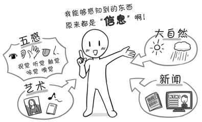
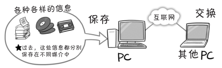

# “信息”到底是什么？

“信息”、“信息技术”、“IT”这些词汇在我们日常生活中的普及有 10 年以上的时间了。

这些词汇大多时候是和互联网技术、计算机技术等一起被提及的，但并不总是伴随着新技术出现。

那么，“**信息**”究竟是什么？ 

用一句话来解释，“存在于我们身边的，可以通过五感（感官）感知到的所有东西”就是信息。

> 

举个例子，大自然中发生的许许多多的事情，以及绘画、照片、音乐、小说等艺术作品，报纸、广播、电视等形式的新闻及娱乐节目，这些都是信息。

除了广播和电视等媒体，信息中的大多数都早在电被发明之前就存在了。这些信息在社会中传播的时候，就对我们的生活产生了影响。

从古代开始，关于粮食的信息就一直被人们所重视。在为了争夺粮食而进行的战争中，报告战果的信息是非常重要的。近些年来，粮食产量相关的信息越来越受重视，这些信息有时候还会成为投机者购买期货的依据。进而，长期的气象预报也会变得越来越重要。然而，这些信息并不都是进入互联网社会后才开始传播的，早在江户时代（1603-1868 年），纪伊国屋文左卫门就已经在他的商业活动中运用这些信息了。

可见，“信息”早在古代就已经存在，并且被使用了。

那么，“信息”和现在的数字技术相结合会带来什么？

通过“**信息数字化**”（参考第 12 页），包括文字、声音（音乐）、图片、视频（电影、 动画）在内的所有信息，都能够通过**数字通信线路**（如互联网）进行**交换**，并且以数字形式**保存**在**同一媒介**（如硬盘）中，这便是信息数字化带给我们的最具有价值的东西。

> 

数字化处理后的信息可以在连接于同一条通信线路的 PC 间直接交换，并且可以根据需求进一步处理。随着信息量的增加，除了单独利用信息，人们会对信息进行组合分析，过去未被注意到的新信息形态也随之诞生。

通信，或者叫信息传输技术，随着近代电气、电子工程的发展取得了很大的进步，电信技术以及广播电视产业的发展亦加速了通信技术的发展。2011 年 7 月，日本电视转播已经基本实现了数字化。技术层面上，这属于数字通信技术和视频压缩技术的实际应用。

然而，数字化技术的中心是负责各种运算的 CPU。
