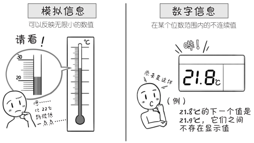
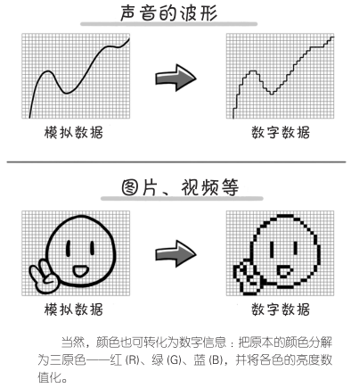

# 数字信息与模拟信息有什么区别？

将文字、声音、图片、视频等信息用数字 0 和 1 来表示的过程就是“信息数字化”。经过数字化处理后，这些信息就会成为 CPU 运算的对象。

与**数字化**相对应的处理方法是**模拟化**。

数字化与模拟化有什么区别？

通过温度计和体温计，我们可以简单明了地理解模拟化和数字化的区别 ：利用酒精和水银遇热膨胀的特性，将温度变化转换为体积变化并显示刻度值的是模拟化 ；利用传感器将温度转换成电压，经计算后显示温度值的是数字化。

可以说，模拟信息是连续的值，而数字信息是离散（不连续）的值。

英语“数字”（digit）有掰手指头数数字的意思，因此容易被误认为计算机可以处理的信息仅限于整数，其实不然。

除了整数，有限小数也属于数字信息。

简单点说，数字化处理就是把数值都转化为某一最小单位基准的整数倍的过程。

那么，数字化信息（数字数据）和原本的模拟信息（模拟数据）相比，信息本身发生了什么变化？

下图展示的是二者差异放大后的效果：

正如刚刚所展示的那样，将模拟信息转化为数字信息时会舍弃部分信息，因此信息量会变小。由于舍弃的信息量很小，实际中人眼以及人耳无法分辨出哪一部分信息被舍掉了。

一些人类感官不足以察觉的信息被舍弃之后生成的数字信息可以存储，也可以通过通信线路传输。这时就需要进行“数据压缩”和“数据解压”。

通过将声音以及图片、视频等数据中那些即使被舍弃也不会被注意到或者不影响整体效果的部分去除，从而减小信息量的压缩方法已经普及。由于压缩时削减了信息量，压缩后的信息无法复原，这样的压缩方法被称作不可逆压缩（有损压缩）。

然而，对于文章等文字信息，如果压缩后无法复原，就会给我们带来不便。遇到这种情况，就要采用可逆压缩（无损压缩）。

只要是数字信息，就可以通过 CPU 的算术或逻辑运算进行压缩和解压。

可以说，所有的信息都与运算相关。

当被问到“数字”的含义时，有人会说是“以 0 和 1 表示的世界”。然而，“数字”的本质并非如此，把用 0 和 1 表示的信息加工成对我们的生活有益的信息，这才是信息数字化的关键。

此外，与模拟信息相比，利用通信技术传输数字信息时不易受外部（噪声）干扰，这也是信息数字化的优势。

为了更具象征性，我们使用“0”和“1”表示数字信息。实际上，CPU 内部处理的其实是表示“压”的“高”与“低”，以及电流的“有”与“无”等状态的电信号。

这也是书籍等出版物中常用“○”和“●”表示的原因。

用于表示数字信息基本要素的“0”和“1”只是具有象征性意义的符号，并非实际值，这一点要注意。