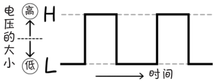

# 0 和 1 是两种相反的状态

**桂城步美：**

> 我先提个问题！
> 
> 之前虽然听你说过“计算机是 0 和 1 的世界”，但是感觉有点过于抽象了，还是不太明白……
> 
> 0 和 1 到底是什么？

**狩野佑：**

> 哎呦，突然问这么犀利的问题。实际上，0 和 1 表示的是两种相反的状态
> 
> 与其说它们是数字，不如说它们是像信号一样的东西

**桂城步美：**

> 相反的两种……
> 
> 是像“光与影”、“生与死”、“开和关”一样的关系吗？

**狩野佑：**

> 说的没错！
> 
> 具体点说，计算机中有电压**高**于某一基准值的高电平（H）和电压**低**于某一基准值的低电平（L）两种状态
> 

**注解**

> **电压**是使电流动的“力”的大小。

**桂城步美：**

> 原来如此！感觉这两种很容易分清楚
> 
> 一种是电压高（H），一种是电压低（L），很简单！

**狩野佑：**

> 对
> 
> 计算机就是使用 0 和 1 两个值进行运算的