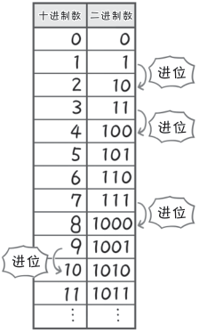
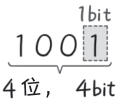

# 十进制数与二进制数

**桂城步美：**

> 嗯。不过，只依靠 0 和 1 两个值可以做什么呢？
> 
> 只有两个值，不是连简单的计算都无法完成吗？

**狩野佑：**

> 噗……见识短浅又愚蠢的人啊！
> 
> 计算机和人类的思考方式可不一样！
> 我们人类使用的是有 10 个数字（0 ～ 9）的十进制数
> 
> 可是计算机使用的是只用 0 和 1 表示的二进制数
> 
> 看这张图你就明白，有 0 和 1 就足够了！
> 

**桂城步美：**

> 哇——确实只有 0 和 1 ！二进制数会不停地进位

**狩野佑：**

> 顺便说一下，二进制数的每一位（0 或 1）都代表 1bit，这个你可要记牢！

**桂城步美：**

> 4 位二进制数就是 4bit。那么，表示 1001（十进制数 9）就需要 4bit
> 

**狩野佑：**

> 那我继续往下讲！
> 准备好进入 0 和 1 的世界了吗！

**桂城步美：**

> 啊，嗯！
> 
> 什么东西都能讲得很起劲啊……