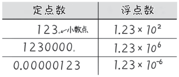

# 定点数和浮点数

**狩野佑：**

> 接下来，我要教你认识一个很重要的概念。实际中，计算机表示数值时会用到定点
数和浮点数。
> 
> 比如，进行涉及“0.000…001”等非常小的值和“1000…”等非常大的值的计算时，
表示为浮点数会更方便。

**桂城步美：**

> 嗯？为什么？有什么不一样？

**狩野佑：**

> 例如，“1 亿”用十进制数表示就是“100000000”，相比之下表示为“$10^8$”就显得简洁且方便多了
> 
> 这就是科学记数法，$10^n$中的 n 被称为指数（幂）。
> 
> 浮点数便是用这样的指数形式表示的。
> 
> 与之相对，**定点数**是我们日常所用的表示形式，小数点在整数位之后。
下面是定点数和浮点数的比较结果：
> 

**桂城步美：**

> 原来如此，感觉用定点数表示很大的值或很小的值时，所需的位数会不断增加。
> 
> 而用浮点数表示时，改动指数的值就可以了，的确很方便！

**狩野佑：**

> 没错。
> 
> 刚刚我们是用十进制数来举例的，而计算机使用的是二进制数，因此更需要
考虑位数问题了。
> 
> 计算机常用的表示形式如下 ：
> 

> 这里的“1.69”只是一个举例用的假设值。（这个值本应用二进制数表示，但是为了便于理解，这里使用十进制数表示）
> 
> 但是要注意，**尾数部分**的值必须介于 1 和 2 之间。

**桂城步美：**

> 嗯。用这样的形式来表示，即便是非常大或者非常小的值，计算机也可以简单地进
行处理和计算了。

**狩野佑：**

> 没错。
> 
> 另外，**能够以多快的速度进行浮点数计算**，也和计算机（CPU）的性能有很大关系。我们将在第 138 页对其进行说明。
> 
> 一般来说，科学计算通常进行的是 15 位左右的计算，特殊情况下也会进行多达 30位的计算。
> 
> 但是，在近些年的加密技术中经常会涉及多达 300 位以上的整数处理。
> 
> 顺便说一下，即便是在短时间内进行高速图像处理的游戏机，浮点计算也很重要。

**桂城步美：**

> 哇……这可早就超出口算的范围了。
> 
> 虽然输给计算机心有不甘，但还是希望看到计算机应用在各个领域发展。