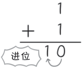
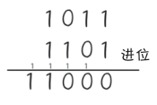
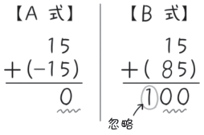
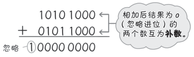
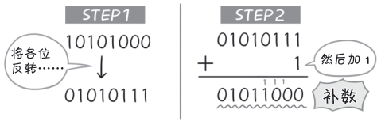

# 二进制数的加法和减法

**狩野佑：**

> 下面，终于可以给你讲二进制数运算了。
> 
> 我们先看**加法**。
> 
> 1bit（1 位）和 1bit 相加有下面几种情况：
> - ０＋０＝０
> - ０＋１＝１
> - １＋０＝１
> - １＋１＝１０

**桂城步美：**

> 嗯，这个很容易懂。
> 
> 最后一个 1+1=10 是说，进位之后十位加 1、个位变为 0，对吧。
> 

**狩野佑：**

> 是这样。能理解 1bit 的加法，也就可以进行多位数的计算了。
> 
> 例如，进行二进制数计算 $(1011)_2$ + $(1101)_2$ 时（$()_2$表示二进制数，$()_{10}$表示十进制数），进位过程如下：
> 

**桂城步美：**

> 嗯嗯，只要记住进位就好了。
> 
> 二进制数的加法很简单嘛！
> 
> 不对，可能是因为我太优秀了。

**狩野佑：**

> 喂——那接着我们要看**减法**了。
> 
> 在减法运算中，用“**补数**”的概念表示负数是很重要的。
> 
> 和被减数的补数（原数的负数）相加，就相当于是减掉了原数。怎么样，这个方法
很独特吧？

**桂城步美：**

> 啊……抱歉在你讲得正起劲的时候打断你……
> 
> 但是我完全没听懂……究竟是什么意思？

**狩野佑：**

> 那我用十进制数来举例说明一下。
> 
> 例如，加上 -15 是和减去 15 是完全相同的计算，没错吧？
> 
> 但是，如果不允许使用减号，应该怎么办？
> 
> 可以用其他的数字表示 -15 吗？

**桂城步美：**

> 这……这我怎么知道……不要摆架子，快给我讲清楚！

**狩野佑：**

> 那么，好好看看下面的两个算式。
> 

> 只看计算结果的最后 2 位数，A 式的结果是 0，B 式的结果是 00。
> 
> 也就是说，在只考虑计算结果最后 2 位的情况下，15+（-15）的结果和 15+（85）的结果是**完全一样**的！

**桂城步美：**

> 哎哎哎！ 0 和 00 在数值上没什么两样，但是 B 式的结果 100 里的“1”怎么办？

**狩野佑：**

> 唉，这是以只计算 2 位为前提进行的计算，所以 2 位以上的进位就不管它了。
> 
> 当做没看到吧！超出的部分被称为“溢位”，可以忽略！

**桂城步美：**

> 啊——这是什么道理？这样也可以吗？

**狩野佑：**

> 没想到吧。
> 
> 在这个时候，对 15 来说，85 就是其相对于 100 的**补数**。
> 
> 也就是说，补数就是和原数相加后需要进位的数。
> 
> 同理，补数就相当于原数的负数。
> 
> 也就是说，85 和 -15 实质上是一样的。
> 
> 例如，减法计算 9647-1200 ＝ 8447 与加法计算 9647+8800=18447，忽略最
前面的进位就会发现后面的 4 位是一致的。
> 
> 也就是说，使用 1200 相对于 10000 的补数 8800 进行加法运算，就可以得到与实行减法相同的结果。

**桂城步美：**

> 这个想法也太大胆了吧！
> 
> 不过，有了补数，减法可以变成加法，这样计算起来确实很方便。
> 
> 不过，这个歪理用在二进制数上会怎么样呢？

**狩野佑：**

> 这不是歪理，是正儿八经的理论好吗！
> 
> 服了你了，我来介绍一下二进制数的做法。
> 

> 如上图所示，忽略超过位数条件的进位，相加后结果为 0 的两个数互为**补数**。
> 
> 进行减法运算时，只需要将被减数与减数的补数相加就可以了。

**桂城步美：**

> 嗯……不过，求二进制数的补数好像很难……

**狩野佑：**

> 求二进制数的**补数**，有简单的方法，往下看你就明白了。
> 
> 试着求一求减法运算所需的补数！
> - `Step 1` 将原数的各位反转（求 1 的补数）
> - `Step 2` 用反转后的数加 1
> 
> 这样就求出补数了！
> 加上这个补数和减去原数的效果是一样的！

**桂城步美：**

> 噢，明白。
> 
> 我试着求了一下刚刚举例的数字的补数。方法很简单。
> 

**狩野佑：**

> 计算机内部（实际是 ALU）也是以这样的原理进行算术运算（加法运算和减法 
运算）的。
> 
> 只不过 ALU 的减法运算是，先算出原数（被减数）+ 减数各位反转数，然后再加 1。
> 
> 顺序虽然有一点点不同，不过原理是一样的，对吧？

**桂城步美：**

> 原来如此。这是二进制数才具有的优势吧！