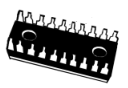

# IC 中有逻辑电路

**狩野佑：**

> 下面让我们进入今天的主题
> 
> 仔细看看这些！
> 

**桂城步美：**

> 不能把虫子带到餐厅里。

**狩野佑：**

> 不是虫子！
> 
> 这个是非常重要的电子器件，叫做 IC（集成电路）
> 
> 很多电子设备中都有它
> 
> 电脑中的 CPU 其实也是高级且结构复杂的 IC

**桂城步美：**

> 不过这个虫子……
> 
> IC 有好多银色的脚

**狩野佑：**

> 这些引脚其实是电信号的通道
> 

> 数字信号（电信号）0（L）或1（H）就是通过它们输入或输出的

**桂城步美：**

> 不单单是装饰，是有作用的啊

**狩野佑：**

> 下面是重点！
> 
> 用到 0 和 1 的**逻辑运算**仿佛是隐藏在 IC 的中心进行的

**桂城步美：**

> 逻辑运算……
> 
> 感觉比算术运算的加减法要难……
> 
> 不对，对擅长逻辑思考的我来说应该很简单
> 
> ……我是这样想的

**狩野佑：**

> 不用那么紧张，逻辑运算其实也很简单
> 
> 让你有一个初步的印象。其实，逻辑电路是以这样的形式……
> 

**桂城步美：**

> 嗯，有 4 个相同的符号，而且每一个都连接着引脚……

**狩野佑：**

> 那么，我们重点来看其中的一个
> 

> 如图所示，逻辑电路的基本结构是 **2 个输入端**、**1 个输出端**

**桂城步美：**

> 原来如此，我觉得就像这样。
> 
> 逻辑电路就像一个黑箱，只要输入什么东西，就会有结果输出
> 
> 当然，输入和输出都只能是 0 或 1
> 

**狩野佑：**

> 嗯，是这样的