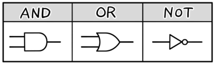
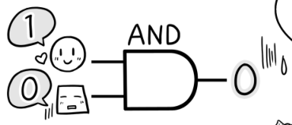
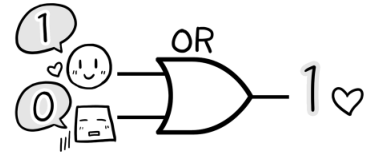

# 三种基本逻辑电路（AND、OR、NOT）

**狩野佑：**

> 下面，我介绍一下这个**黑箱**，也就是逻辑电路
> 
> 基本逻辑电路有**AND 电路（与门）**、**OR 电路（或门）**、**NOT 电路（非门）**三种
> 

> 这些你要给我全都记住了！

**桂城步美：**

> 这也太严厉了吧？！

**狩野佑：**

> 并没有……这些电路的规则都十分简单
> 
> 让我们用面试的例子来看看
> 
> 我们假设有 1（合格）和 0（不合格）两个值
> 
> 然后假设两个输入值是 2 位面试官的判断结果

**狩野佑：**

> 在 AND 电路中，只有两个输入都为 1 时，结果才是 1 ；只要其中一个输入为 0，结果就变成 0

**桂城步美：**

> 没有得到 2 个“合格”的判断，结果就是“不合格”了吧……
> 

**狩野佑：**

> 在 OR 电路中，只要有一个输入为 1（合格），结果就是 1（合格）

**桂城步美：**

> 没有得到 2 个“合格”的判断，结果就是“不合格”了吧……
> 

**狩野佑：**

> NOT 电路的输出结果是输入的**反转**，输入为 1 时，结果就是 0

**桂城步美：**

> 有这种事？！ 
> 
> 完全否定面试官的意见？
> 

**狩野佑：**

> ……**逻辑电路**差不多就是如此了
> 
> 即便输入完全相同，AND 和 OR 的输出结果也有可能不同

**桂城步美：**

> 最后这个 NOT 太让人想不通了，让面试官怎么想……