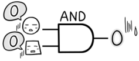
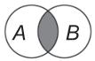
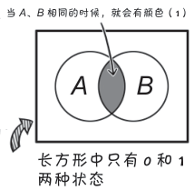

# 真值表、文氏图

**桂城步美：**

> 不过，一定有特殊情况存在的吧？
> 
> 在两个判断都是“不合格”（输入都为 0）的情况下，输出结果也是“不合格”（输出 0）……很普通啊……
> 

**狩野佑：**

> 呵呵……所以，接下来我想给你看的是——
> 
> 包含所有情况的“真值表”！
> 
> 真值表中包含了所有能够考虑到的输入和输出模式！
> 
> 好好看看，这就是真值表！
> 

**桂城步美：**

> 哦，这样我就知道了输入、输出的全部可能性，非常方便！

**狩野佑：**

> **文氏图**对思考逻辑电路的输出结果很有帮助
> 

**桂城步美：**

> 噢，初中的时候好像学过这个

**狩野佑：**

> 嗯，重点是，文氏图也是用**两种状态**表示的
> 
> 长方形中有“无颜色”（0）和“有颜色”（1）两部分，对吧？

**桂城步美：**

> 就是说，用文氏图表示的 0 和 1 是可视的！
> 

**狩野佑：**

> 正是如此！那么，下面我就要用这种方法全面介绍三种基本电路了哦