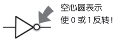
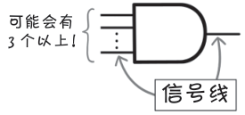

# AND 电路、OR 电路、NOT 电路小结

**狩野佑：**

> 下面就是 3 种基本电路的总结了。
> 
> 对应的符号、真值表、文氏图都要记好了！
> 
> **AND 电路（与门）**
> 

> 
> - 在 **AND 电路**中，输入 A 和 B 均为 1 时，输出 Z 为 1。
> - 这种关系可用 Z = A·B 表示。
> - AND（逻辑与）可用符号“·”“∩”表示。
> **OR 电路（或门）**
>  

> 
> - 在 **OR 电路**中，输入值 A 和 B 中的一个为 1 时，输出 Z 为 1。
> - 这种关系可用 Z = A + B 表示。
> - OR（逻辑或）可用符号“+”“∪”表示。
> 
> **NOT 电路（非门）**
> 
> 

> 
> - 在 **NOT 电路**中，输入 A 为 1 时，输出 Z 为 0。
> - 这种关系可用 $Z = \overline{A}$ 表示。
> - NOT（逻辑非）可用符号“-”表示。
> 
> 

**桂城步美：**

> 噢，我明白了，还可以表示为“A・B”“A + B”“A ”等的关系式。

**狩野佑：**

> 嗯。这里要注意，举例的 AND 电路和 OR 电路有 2 个输入，但是实际中可能有 3
个以上。
> 

> 在这种情况下，AND 电路的规则变为“当所有输入为 1 时，输出值为 1”，OR 电路的规则变为“有一个输入为 1 时，输出为 1”。

**桂城步美：**

> 然后，输入和输出所用的线就是信号线了吧。
> 
> 用来传输 0 和 1 这样的数字信号的线，这样理解就很容易记住啦。