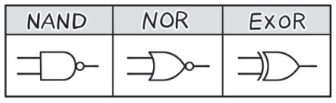

# 其他类型的基本逻辑电路

**狩野佑：**

> 下面，针对 **NAND 电路（与非门）**、**NOR 电路（或非门）**、**EXOR 电路（异或门）**（EXOR 也表示为 XOR 或 EOR 等）这三种基本逻辑电路进行说明
> 

**桂城步美：**

> 刚刚不是说基本逻辑电路有 AND、OR、NOT 三种吗……
> 
> 刚刚说的话不算数了吗！你这个骗子！怎么还有啊！

**狩野佑：**

> NAND、NOR、EXOR 这三种也是应知应会的
> 
> 至于理由……
> 
> 学了你就知道了

**桂城步美：**

> 刚刚没想到这么较真！