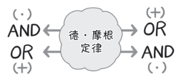
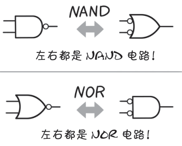

# 德·摩根定律

**狩野佑：**

> 定律”听起来是不是很迷茫？让人有一种莫名的悸动？
> 
> 下面我要讲的就是一条很重要的定律！
>
> 它就是逻辑运算中不可或缺的**德·摩根定律**：
> - $\overline{A · B} ＝ \overline{A} + \overline{B}$
> - $\overline{A ＋ B} ＝ \overline{A} · \overline{B}$

**桂城步美：**

> 啊，虽说很重要，但今天吸收的是不是太多了？
> 
> 就像快餐，偶尔吃一次感觉还挺好吃的……

**狩野佑：**

> 喂，得意忘形了！
> 
> 不过，这个公式乍一看确实会让人觉得挺难的……
> 
> 该定律的重点是，AND（逻辑与）和 OR（逻辑或）可以**互换**。这个你能理解吗？

**桂城步美：**

> 左边和右边确实有很大的区别，一边是“・”，另一边是“+”，如下图所示。
> 

**狩野佑：**

> 是这样！
> 
> 也就是说，根据德 · 摩根定律，我们可以下图那样进行电路转换，
这样也有助于电路图的理解。
> 

**桂城步美：**

> 确实！不过，左右两边看起来不一样啊。区别这么大，真的没关系吗？

**狩野佑：**

> 嗯嗯。表示方式虽然很不一样，但**本质上没有区别**。
> 
> 逻辑电路（数字电路）是 0 和 1 组成的世界，因此把它们倒过来看也完全可以。
这是它的特征的一种应用方式。

**桂城步美：**

> 原来如此……只要按照定律转换，就没有什么好顾虑的。这条定律值得记住！