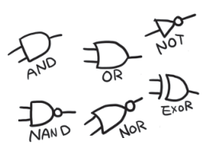
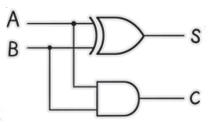

# 加法电路

**桂城步美：**

> 哈，终于把电路符号记全了
> 
> 喏
> 

> 看！我画得多熟练！

**狩野佑：**

> 呵呵

**桂城步美：**

> 笑什么笑？！

**狩野佑：**

> 哎呀，不好意思
> 
> 你这只是对自己的涂鸦技术满意，但是并没有真正理解逻辑电路
> 
> 只有能用基础电路组成**实现特定功能的电路**才有意义，知道吗！！

**桂城步美：**

> 什么！是这样吗？

**狩野佑：**

> 给你看看，这才是有意义的电路 !
> 

> 让你见识一下“半加器”运算电路的厉害 !
> 
> 这个是非常古典的初级电路
> 
> 加法器，也就是进行加法运算的电路

**桂城步美：**

> 感觉这种符号组合看起来是很棒……用到了 AND 电路和 EXOR 电路，对吧！
> 
> 但是，为什么这个电路可以进行加法运算……
> 
> 嘁……听你讲也不是不行！

**狩野佑：**

> 想让我教你就直说！