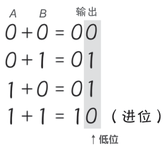
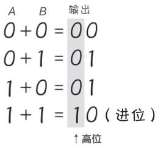
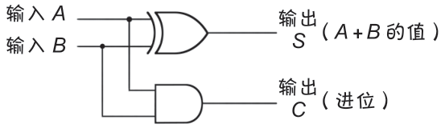

# 半加器

**狩野佑：**

> 我来解释一下什么是**半加器**。
> 
> 按照你现在的水平，应该很容易理解。
> 
> 回想一下前面的内容，1bit（1 位）的加法如下：
> - ０＋０＝０
> - ０＋１＝１
> - １＋０＝１
> - １＋１＝１０
> 
> 总结后就得到下面这张像真值表的表格了：
> 

> 相加的 1bit 分别写作输入 A 和输入 B。
> 
> 由于输出结果要统一成两位数，因此答案为 1 时写作 01。
> 
> 注意到什么了吗，注意看灰色的部分。

**桂城步美：**

> 哎哎？该不会是……
> 
> 看低位的话，结果和 ECXOR 电路的真值表完全相符！
> 

> EXOR 的特点也是当输入 A 和 B 不同时输出为 1 ！

**狩野佑：**

> 是的，没错。
> 
> 那么这一次，注意看输出结果的高位。
> 

**桂城步美：**

> 这一次好像和 AND 电路的真值表相符。
> 

> AND 电路的特点也是输入 A 和 B 均为 1 时输出为 1。
> 
> ……也就是说……
> 
> 将 EXOR 和 AND 组合，并且将输出组成两位数（高位和低位），就可以进行 1bit 的加法运算了。
> 

> 像这样的具有两个输入、两个输出的电路被称为半加器。
> 用它就可以进行 1bit 加法运算了！