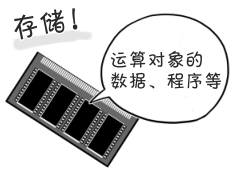

# 记忆电路是必不可少的！

**狩野佑：**

> 这是本章的最后一部分内容了
> 
> 我们来谈一谈**有记忆功能的电路**

**桂城步美：**

> 呃……
> 
> 有记忆功能的电路就是**存储装置**了呗
> 
> 之前你给我讲过这个……
> 

**狩野佑：**

> 嗯，**存储器**（主存储装置）的确具有代表性
> 
> 不过，实际上 **CPU 中也是有存储装置**的！
> 
> 它的名字叫“**寄存器**”！

**桂城步美：**

> 寄……存器？第一次听到。
> 
> 这个寄存器是什么东西？

**狩野佑：**

> 简单来说……寄存器就好像**一次性备忘录**
> 
> 在运算时短暂记忆数值！
> 

> 
> 它的结构比存储器简单，只负责**短时间存储**。
> 
> 重要的是，有了这些**存储装置**后，**过去的存储**（状态）也可以成为**运算对象**
> 
> 换句话说，**过去的存储（状态）是会对输出结果产生影响的！**

**桂城步美：**

> 你能说得再通俗易懂点吗？

**狩野佑：**

> 想象一个情景你就明白了
> 
> 例如，你正在自动售货机前准备买饮料

**桂城步美：**

> 哦哦，我要可乐！
> 
> 准备好敲诈一笔！

**狩野佑：**

> 我只是举个例子！
> 
> 假设你想要买 130 日元的可乐，先投了一枚 100 日元的硬币，然后又投了一枚 50 日元的硬币……
> 
> 

> 
> 这时，屏幕显示你投入的金额是 150 日元
> 
> 这就是将过去记忆的已投入的100 日元和刚刚投入的 50 日元相加的结果
> 
> 怎么样？能明白过去记忆的 100 日元对输出结果 150 日元的影响了吧？

**桂城步美：**

> 这样啊……
> 
> 虽然这是理所应当的，但能够明白合计金额是 150 日元，其实是因为有过去的记忆啊

**狩野佑：**

> 像这个自动售货机一样，为了让计算机发挥作用，**记忆电路**是必不可少的
> 
> 

> 
> 在程序中，这样的指令也很多

**桂城步美：**

> 原来是这样，我明白记忆电路的重要性了
> 
> ……我去买个可乐

**狩野佑：**

> 居然真的想喝……
> 
> 幼稚的家伙