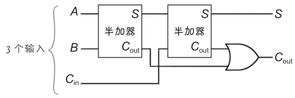
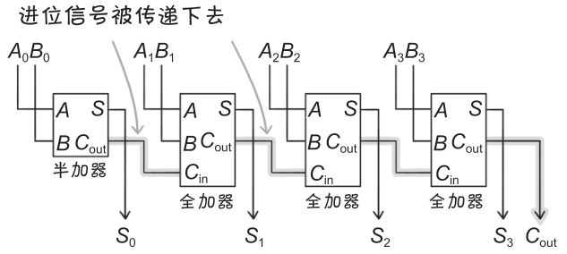

# 全加器、行波进位加法器

**桂城步美：**

> 刚才讲的半加器，理解原理之后真的很简单！
> 
> 嗯……不过，我还是有一些不明白的地方。
> 
> 刚才讲的电路虽然有进位输出，但是低位没有进位输入吧？
> 
> 这样，利用刚才讲的电路就只能进行 1bit 计算，可能不太方便……
> 
> 只能进行 1bit 加法运算，感觉没什么用……

**狩野佑：**

> 唔，这个观点很尖锐嘛。
> 
> 半加器确实没有办法处理低位的进位，只能进行 1bit 加法运算。
> 
> 毕竟是半加器，就像是半份，被埋怨也没有办法。

**桂城步美：**

> 嗯？！我又没埋怨你！为什么要把我当坏人！

**狩野佑：**

> 我的意思是，你只盯着半加器不放的话我也没办法。
> 
> 其实，用两个半加器可以组成全加器。
> 
> 这样，除了输入 A 和 B，还可以输入低位进位。
> 
> 看下页的图你就明白了：
> 

> 像这样的具有 3 个输入和 2 个输出的电路被称为全加器。
> 为了方便理解，图中把半加器表示成了方框。

**桂城步美：**

> 的确，用了 2 个半加器！好像半个人变成一个人了！
> 
> 那么，Cin代表**进位输入**，Cout代表**进位输出**吧。

**狩野佑：**

> 没错。只要将一个个全加器连起来，就能够组成可以进行多位数加法运算的电路了！
> 
> 这样的电路被称为**行波进位加法器**。
> 
> 例如，下面的电路图中有 **4 个加法器**，因此能够进行 **4 位数**的加法运算。
> 

> 方便起见，图中的全加器表示为方框。

**桂城步美：**

> 嗯嗯
> 
> 进位输出和下一位的进位输入相连，这样进位信号被依次传递，计算也就进行下去了。