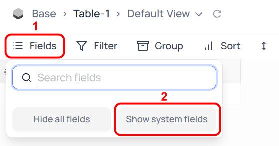
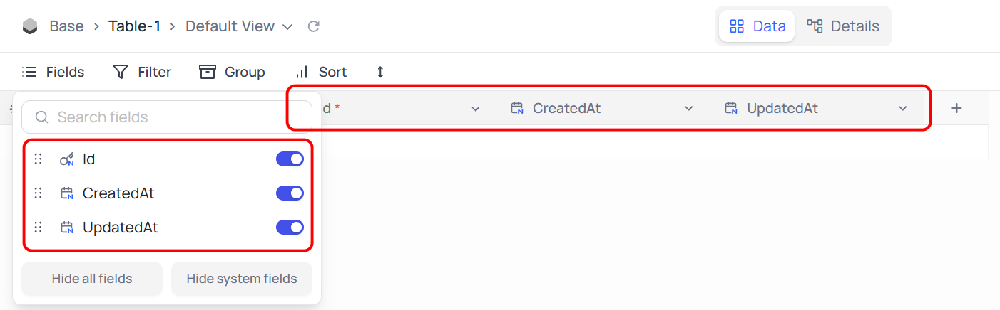
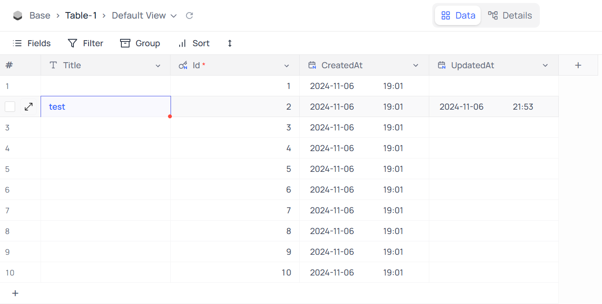

# 主键

`Primary Key`（主键）是一个特殊的数据库表字段，在进行所有与 `Records`（记录）相关的操作时都会使用它。

## 主键的使用

由于它能够唯一地识别表中的单个 `Record`（记录），因此 NocoDB 在与 `Records`（记录）相关的所有操作中会内部使用它。

## NocoDB 中的主键

在 NocoDB 中定义 / 使用的 `Primary Key`（主键）取决于 `Table`（表）的创建方式。总结如下：

1. **从用户界面创建新表 / 从 Excel 导入 / 从 CSV 导入**
   1. 表创建时默认创建的 `ID` 【数据类型：Integer（整型）】 系统字段被用作 `Primary Key`（主键）。
   2. 默认插入额外的系统字段 `CreatedAt`（创建时间） 和 `UpdatedAt`（更新时间）。

---

  
  <strong style="margin-left: 8px;">作者注</strong>

当点击 `Toolbar`（工具栏）中 `Fields`（字段）时，点击 `Show system fields`（显示系统字段），可以将 `ID` 、`CreatedAt`（创建时间） 和 `UpdatedAt`（更新时间） 这 3 个隐藏的系统字段显示在 `Table`（表）中。

系统字段 `ID` 即 `Primary Key`（主键），NocoDB 中 `ID` 为正整数（Positive Integer）。`CreatedAt`（创建时间） 为 `Record`（记录）的创建时间，`UpdatedAt`（更新时间） 为 `Record`（记录）的修改时间。

---

2. **连接到现有外部数据库**
   1. 为 `Table`（表）定义的现有 `primary key` 字段将被保留；NocoDB 不会插入新的 `ID` 字段。
   2. 默认不插入额外的系统字段 `CreatedAt`（创建时间） 和 `UpdatedAt`（更新时间）。

---

  
  <strong style="margin-left: 8px;">作者注</strong>

意味着点击 `Show system fields`（显示系统字段），不会出现 `CreatedAt`（创建时间） 和 `UpdatedAt`（更新时间） 选项，它们并不会被系统自动创建。同时，原数据库中的 `ID` 字段将被保留且不被隐藏，而不会像“从用户界面创建新表 / 从 Excel 导入 / 从 CSV 导入”中自动创建正整数格式 `ID` 且默认隐藏。

---

3. **从 Airtable 导入**
   1. Airtable中的 `ID` 字段将被自动标记为 `Primary Key`（主键），并映射到字段 `ncRecordId` 【数据类型：varchar（可变字符型）】。
   2. 如果在迁移后插入新 `Record`（记录）且在 `Record`（记录）插入期间省略了 `ncRecordId` 字段，NocoDB 将插入自动生成的字符串。
   3. 整个 `Record`（记录）的计算哈希值存储在系统字段 `ncRecordHash` 中。
   4. 默认不插入额外的系统字段 `CreatedAt`（创建时间） 和 `UpdatedAt`（更新时间）。
4. **SDK / API 创建新表**
   1. NocoDB 不会引入默认的 `Primary Key`（主键）字段。必须在表创建期间明确指定（使用属性 `pk: true`）。

> 📖 **问答**
> 
> **1.如果缺少 `Primary Key`（主键）怎么办？**  
> 
> 可以创建没有 `Primary Key`（主键）的表。  
> - 外部数据库表可以在没有 `Primary Key`（主键）配置的情况下创建。  
> - 可以使用 SDK / API 创建没有 `Primary Key`（主键）的新表。 
>  
> 在这种情况下，可以在 NocoDB 中为该 `Table`（表）创建新的 `Record`（记录），但由于没有办法唯一识别这些 `Record`（记录），因此无法更新或删除 `Record`（记录）。
> 
> **2.我可以将 `Primary Key`（主键）更改为 `Table`（表）中的其他字段吗？**  
> 
> 不能通过 NocoDB 用户界面更新主键。可以直接在数据库级别重新配置它，并显式触发 `meta sync`。