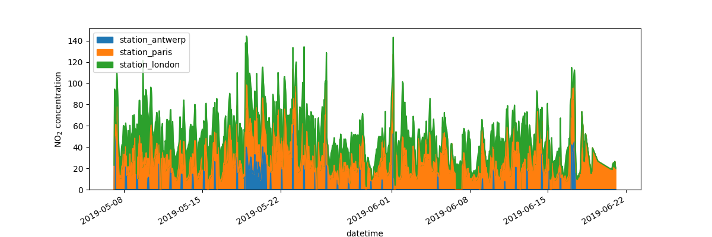

# 如何在 pandas 中创建图表？


```python
In [1]: import pandas as pd
In [2]: pip install -q matplotlib
In [3]: import matplotlib.pyplot as plt
```

在本教程中使用了来自 [OpenAQ](https://openaq.org/) 的[空气质量数据](https://github.com/pandas-dev/pandas/tree/main/doc/data/air_quality_no2.csv)，并使用 [py-openaq](http://dhhagan.github.io/py-openaq/index.html) 包获取。`air_quality_no2.csv` 数据集提供了位于巴黎、安特卫普和伦敦的测量站 _FR04014_、_BETR801_ 和 _London Westminster_ 的数据。
    
```
In [4]: air_quality = pd.read_csv("data/air_quality_no2.csv", index_col=0, parse_dates=True)
In [5]: air_quality.head()
Out[5]: 
                     station_antwerp  station_paris  station_london
datetime                                                           
2019-05-07 02:00:00              NaN            NaN            23.0
2019-05-07 03:00:00             50.5           25.0            19.0
2019-05-07 04:00:00             45.0           27.7            19.0
2019-05-07 05:00:00              NaN           50.4            16.0
2019-05-07 06:00:00              NaN           61.9             NaN
```
    
> **注意**
>   
> 使用 `read_csv` 函数中的 `index_col` 和 `parse_dates` 参数，分别将第一个 (0 列) 设置为 `DataFrame` 的索引并将日期转换为 [`Timestamp`](https://pandas.pydata.org/docs/reference/api/pandas.Timestamp.html#pandas.Timestamp "pandas.Timestamp") 对象。
    
我想快速检查数据的可视化效果。
    
```
In [6]: air_quality.plot()
Out[6]: 
<Axes: xlabel='datetime'>
```

.png)
    
使用 `DataFrame` 时，pandas 默认会为每个包含数值数据的列创建一个折线图。
    
我只想绘制表格中巴黎的数据列。
    
```
In [7]: air_quality["station_paris"].plot()
Out[7]: <Axes: xlabel='datetime'>
```

![air_quality[station_paris].plot()](air_quality[station_paris].plot().png)
    
要绘制特定列，可以结合使用 [如何选择 DataFrame 的子集？](http://localhost:3000/books/pandas/Getting_started/Getting_started_tutorials/How_do_I_select_a_subset_of_a_DataFrame/index.html) 中的选择方法和 [`plot()`](https://pandas.pydata.org/docs/reference/api/pandas.DataFrame.plot.html#pandas.DataFrame.plot "pandas.DataFrame.plot") 方法。`plot()` 方法适用于 `Series` 和 `DataFrame`。
    
我想将伦敦和巴黎的测量值进行对比。
    
```
In [8]: air_quality.plot.scatter(x="station_london", y="station_paris", alpha=0.5)
Out[8]: <Axes: xlabel='station_london', ylabel='station_paris'>
```

.png)

除 `plot` 函数的默认 `line`（折线）图外，还可以使用其他绘图方式。让我们使用一些标准 Python 代码查看可用的绘图方法：

```
In [9]: 
[
    method_name
    for method_name in dir(air_quality.plot)
    if not method_name.startswith("_")
]  
Out[9]: 
['area',
 'bar',
 'barh',
 'box',
 'density',
 'hexbin',
 'hist',
 'kde',
 'line',
 'pie',
 'scatter']
```

> **注意**
>
> 在许多开发环境中，如 IPython 和 Jupyter Notebook，可以使用 TAB 键查看可用的方法，例如 `air_quality.plot.` + TAB。

其中一个选项是 [`DataFrame.plot.box()`](https://pandas.pydata.org/docs/reference/api/pandas.DataFrame.plot.box.html#pandas.DataFrame.plot.box "pandas.DataFrame.plot.box")，即 [箱线图](https://en.wikipedia.org/wiki/Box_plot)。以下示例适用于空气质量数据：

```python
In [10]: air_quality.plot.box()
Out[10]: <Axes: > 
```

.png)

`前往用户指南` 关于默认折线图以外的绘图方法，请参阅用户指南中的 [支持的绘图样式](https://pandas.pydata.org/docs/user_guide/visualization.html#visualization-other) 章节。

我想为每列数据创建单独的子图。 

```
In [11]: axs = air_quality.plot.area(figsize=(12, 4), subplots=True)
```

.png)

`subplots` 参数可以让每个数据列在单独的子图中显示。值得一看 pandas 各种绘图函数的内建选项。
    

`前往用户指南` 更多格式化选项可在用户指南的 [图表格式化](https://pandas.pydata.org/docs/user_guide/visualization.html#visualization-formatting) 章节中查看。

我想进一步定制、扩展或保存生成的图表。
    
```
In [12]: fig, axs = plt.subplots(figsize=(12, 4))
```

.png)

```
In [13]: air_quality.plot.area(ax=axs)
Out[13]: <Axes: xlabel='datetime'>
```

```
In [14]: axs.set_ylabel("NO$_2$ concentration")
Out[14]: Text(4.444444444444466, 0.5, 'NO$_2$ concentration')
In [15]: fig.savefig("no2_concentrations.png")
```



每个由 pandas 创建的图表对象都是 [Matplotlib](https://matplotlib.org/) 对象。Matplotlib 提供了丰富的图表自定义选项，在 pandas 和 Matplotlib 之间建立联系可以利用 Matplotlib 的所有功能。这种方法在上例中已应用：

```
fig, axs = plt.subplots(figsize=(12, 4))        # 创建一个空的 Matplotlib 图表和轴
air_quality.plot.area(ax=axs)                   # 使用 pandas 将区域图添加到图表/轴上
axs.set_ylabel("NO$_2$ concentration")          # 使用 Matplotlib 自定义
fig.savefig("no2_concentrations.png")           # 使用 Matplotlib 保存图表
plt.show()                                      # 显示图表
```

> **要点概要**
>
> - `.plot.*` 方法适用于 `Series` 和 `DataFrame`。
> - 默认情况下，每列作为不同的元素（线图、箱线图等）绘制。
> - pandas 创建的任何图表都是 Matplotlib 对象。

`前往用户指南`：关于 Pandas 中绘图的完整概述，请参阅[可视化页面](https://pandas.pydata.org/docs/getting_started/intro_tutorials/04_plotting.html../../user_guide/visualization.html#visualization)。